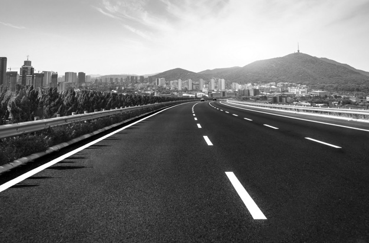

# Lane-Detection
Using OpenCV to detect lanes to aid Autonomous Driving Vehicles

Doing the follow procedure step by step:

1) Original Image:

2) Gray Scale:

3) Gaussian Blur:

4) Canny:

5) Region of Interest:

6) Lines added to ROI

7) Final Combination

